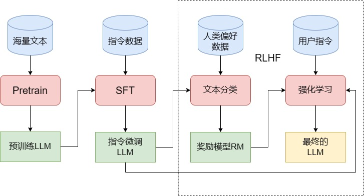
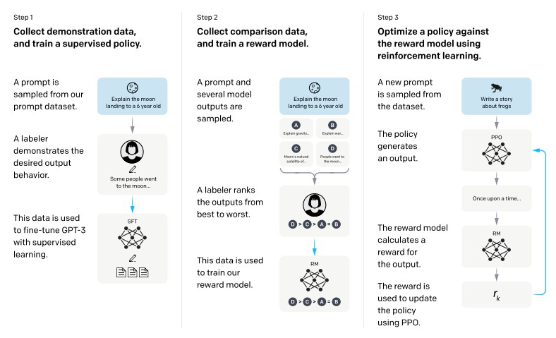
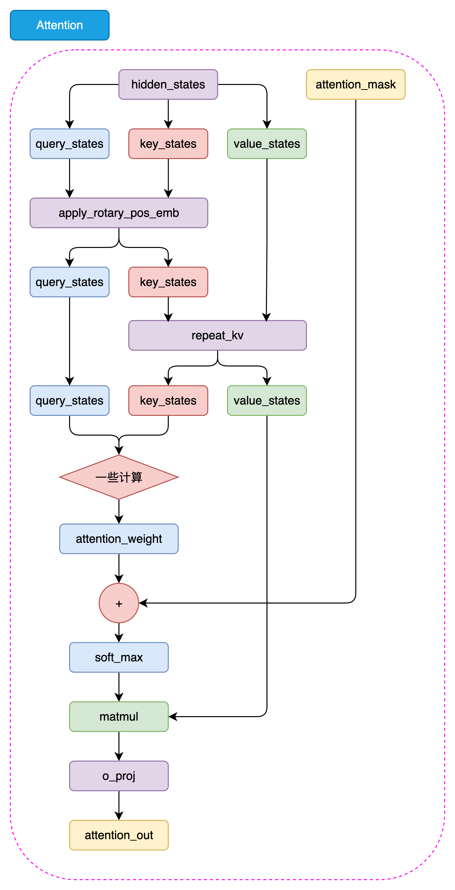

从 Transformer 模块继续往上看，LLM 可以先按一个系统来理解：**概率语言模型底座 + 分阶段训练 + 输入输出协议**。

这篇文章把两条线接起来：一条是训练目标、能力边界和对齐思路，另一条是 tokenizer、样本构造、loss mask、generate 等实现位置。复习时重点看：每个抽象能力最后落到哪种数据格式、训练信号或推理流程。

---

## 一、先把 LLM 的整体框架理顺

理解“大语言模型”时，先不要停在“更大、更强”。更清楚的入口是三个问题：底层目标是什么，能力为什么会变化，训练为什么要分阶段。

### 1.1 LLM 的本质仍然是语言模型

LLM 的底层目标可以先记成一句话：**它本质上仍然是在做 next-token prediction**。

如果写成概率形式，就是：

$$
p(x) = \prod_{t=1}^{T} p(x_t \mid x_{1:t-1})
$$

这意味着，无论模型后来表现得多像助手、推理器或知识库，底座训练仍是在学习“给定前文，下一个 token 最可能是什么”。这个目标会直接决定 Pretrain 的数据组织、SFT 的标签构造，以及推理阶段逐 token 生成的方式。

### 1.2 LLM 的强，来自规模化系统共同作用

不要把 LLM 简化成“更大的 BERT”或“参数更多的 Transformer”。

模型能力的变化，背后往往是多种因素一起放大的结果：

- 模型规模变大
- 数据规模变大
- 训练算力变大
- 训练策略和数据配比更成熟

因此，LLM 的能力提升不能只解释成“网络更深”。更准确的说法是：**规模化训练让语言建模系统在某些规模阈值后表现出新的能力形态。**

### 1.3 区分“涌现、上下文学习、指令遵循、逐步推理”

这些词都和“模型变强”有关，但对应不同层面的能力：

- **涌现能力** 说的是：当模型、数据和训练规模跨过某个阈值之后，一些原来很弱甚至几乎看不见的能力会突然变得明显。
- **上下文学习（In-Context Learning）** 说的是：模型不需要参数更新，只通过 prompt 和 few-shot 示例，就能在当前上下文里临时适配一个任务。
- **指令遵循** 说的是：模型开始学会把输入理解成“用户要求我做什么”，并按要求组织回答。
- **逐步推理** 说的是：模型在处理复杂问题时，能够通过中间步骤把问题拆开，而不是一次性拍出最终答案。

复习时不要把它们混成一句“模型更聪明了”。看到一个模型表现变好，要继续追问：是知识覆盖更充分、上下文利用更好、指令理解更稳，还是推理步骤更完整？

### 1.4 多语言、长上下文、多模态是扩展能力，幻觉是系统风险

还有一个需要尽早建立的判断是：**能力扩展和可靠性不是同一件事。**

模型可以支持多语言、长上下文，甚至接入图像等多模态输入，但这些能力不等于可靠性。幻觉提醒我们：LLM 仍是概率生成系统，输出流畅并不等于事实正确。

复习锚点：长上下文不等于稳定推理，助手风格不等于事实可靠，语言流畅性不等于知识正确性。

### 1.5 Pretrain、SFT、RLHF/DPO 之所以要分开，是因为它们在解决不同问题

大模型训练要拆成阶段理解，因为每个阶段解决的问题不同。先看粗线条：

  
  
图 1. 训练 LLM 的三个阶段，图片引自 Happy-LLM 原文

| 阶段 | 核心目标 | 复习要点 |
|------|----------|------------------|
| **Pretrain** | 学知识底座与文本分布 | 让模型先变成一个会建模语言分布的系统 |
| **SFT** | 把模型塑形成能回答问题的助手 | 重点是教会它输入输出格式、回答风格和对话模式 |
| **RLHF / DPO** | 让模型更符合人类偏好与安全边界 | 重点是“更有用、更安全、更符合偏好” |

“训练一个 LLM”不是单一动作。Pretrain、SFT 和偏好对齐各自改变不同东西：知识底座、回答行为、偏好边界。只有把阶段分开，后面看代码、数据格式和 loss 才不会混。

从 ChatGPT 的训练流程看，对齐阶段还能拆成监督微调和偏好优化两层。`SFT` 和 `RLHF/DPO` 不能混成一步，因为前者主要学习“怎样回答”，后者主要学习“哪种回答更符合偏好和安全要求”。

  
  
图 2. ChatGPT 三阶段训练示意，图片引自 Happy-LLM 原文

---

## 二、再把最小训练闭环看清楚

前面解释“为什么这样训练”，接下来要看这些目标在代码和流程里落在哪里。最小训练闭环可以整理成：

> **tokenizer -> 数据样本构造 -> Decoder-Only 模型 -> loss 计算 -> 训练循环 -> 生成**

只要这条链路打通，tokenizer、loss、mask、训练循环和生成就不再是散点概念。

### 2.1 Tokenizer 是一整套输入协议

Tokenizer 不只是“把文本切成 token”的工具，它是一套**输入协议**。

除了 BPE、ByteLevel、NFKC 这些技术选择，还要关注：

- 特殊 token 如何定义
- 对话起止符号如何设计
- 角色边界如何标记
- 编码和解码是否能稳定保真
- chat template 如何把多轮对话拼成单个序列

把 tokenizer 理解成协议后，很多问题会变得具体：模型如何知道当前是 user 还是 assistant，哪里应该开始回答，多轮历史怎样保持结构。这些都由特殊 token 和 chat template 规定。

### 2.2 Decoder-Only 模型的关键，不在于堆模块，而在于理解每个设计在解决什么问题

看 LLaMA 风格模型结构时，不要只背模块名，要问每个模块解决什么问题：

先看整体结构，再把下面这些设计放回主干：

  
  
图 3. LLaMA2 结构图，图片引自 Happy-LLM 原文

- `RMSNorm`：让深层网络训练更稳定。
- `RoPE`：把位置信息注入注意力计算，常用于相对位置建模。
- `GQA` 和 `repeat_kv`：在注意力结构里节省 KV 缓存和推理显存。
- `SwiGLU` 风格的 MLP：增强前馈网络的表达能力。
- `embedding` 和 `lm_head` 权重共享：让输入词表表示和输出词表预测共用一套参数。

复习模型结构时，按“模块 -> 解决的问题 -> 对训练/推理的影响”来记。

### 2.3 Pretrain 和 SFT 共享 CLM 底座，差别在监督边界

无论是预训练数据，还是 SFT 数据，最底层都还是在做自回归建模。也就是说，数据往往还是会被整理成类似这样的形式：

- `X = input_ids[:-1]`
- `Y = input_ids[1:]`

因此可以记住：**Pretrain 和 SFT 共享同一个 CLM 底座。**

它们的差别主要在“哪些 token 参与监督”。预训练通常让整个序列参与语言建模；SFT 会把 system/user/history 作为上下文输入，但只让 assistant 的回答部分承担 loss。

`loss_mask` 的作用就是把“只塑形回答行为”落到训练信号边界上。

### 2.4 generate 解释了为什么生成是逐 token 进行的

生成时，模型会在当前上下文上做前向传播，只取最后一个位置的 logits，再根据 `temperature`、`top_k` 等采样策略决定下一个 token。新 token 会被拼回上下文，进入下一轮循环。

这个过程解释了三个现象：

- 为什么训练和推理虽然相关，但运行方式并不完全一样
- 为什么采样参数会显著影响模型输出风格
- 为什么大模型输出会一点点长出来

模型重复、越说越跑偏、不同采样参数导致结果差异很大，都和这个逐 token 生成循环有关。

---

## 三、把概念和实现一一对应

复习 LLM 时，最有效的方法是把抽象概念和代码落点对应起来：训练目标对应数据样本，助手行为对应 loss mask，对话能力对应 chat template，长上下文对应位置编码和注意力开销。

### 3.1 从 next-token prediction 到 X/Y shift

`next-token prediction` 在代码里会直接变成 `X/Y shift`：

- 输入看前面的 token
- 标签预测后一个 token

这就是最基本的 `shift` 操作。所谓“语言模型底座”，就是一种会直接决定数据组织方式和 loss 定义的训练协议。

### 3.2 从“助手塑形”到 loss_mask

SFT 的目标是“助手行为塑形”。落实到实现里，问题会收缩成一句话：

> 哪些 token 应该参与监督，哪些 token 只是上下文条件？

`loss_mask` 浓缩了 SFT 的核心思路：用户输入和历史对话提供条件，assistant 的回答部分提供监督信号。这个边界比“做监督微调”这个词本身更重要。

### 3.3 从“多轮对话能力”到 special tokens 与 chat template

多轮对话能力也要落到数据格式上。只说它来自 SFT 和对齐还不够，还要看训练数据如何被组织成模型能理解的序列。

`special tokens` 和 `chat_template` 会显式标记：

- 一轮对话从哪里开始
- user 和 assistant 的边界在哪里
- 多轮历史应该怎样拼接
- 哪一段是当前应该回答的部分

从这个角度看，对话能力是一套训练协议、数据格式和监督方式共同塑造出来的行为结果。

### 3.4 从“长上下文与位置感”到 RoPE

长上下文也要落到结构和成本上。它不仅是“能放更多文本”，还牵涉位置编码、训练长度、推理缓存和注意力开销。

`RoPE` 解决的是“位置信息如何进入注意力计算”。长上下文能力不是一句宣传语，它背后对应具体的位置编码设计、上下文长度外推策略和推理时 KV cache 成本。

如果把视角进一步缩到注意力层里，这张图就很适合用来理解 `RoPE`、`GQA` 和 `repeat_kv` 为什么总是一起出现：

  
  
图 4. LLaMA2 Attention 结构图，图片引自 Happy-LLM 原文

复习时要把“模型能力”和“结构选择”对应起来，而不是把二者当作独立话题。

### 3.5 从“训练阶段”到“训练闭环”

训练阶段的拆分，最后也会落实成一条可执行的训练闭环。一个能跑起来的训练系统，至少要把很多基础环节连起来：

- 学习率调度
- warmup
- 梯度累积
- AMP 混合精度
- 梯度裁剪
- checkpoint 保存

训练不是只写一个 loss。模型目标、数据格式、mask 设计、优化器设置、训练循环、checkpoint 和生成行为共同构成闭环。缺少其中任意一块，对系统的理解都会变得片面。

---

## 四、最重要的复习结论

复习这篇时，保留下面几条稳定结论。

### 4.1 LLM 先是语言模型，然后才是助手

它的根始终在 `next-token prediction`。只有先接受这一点，后面关于对齐、助手风格、推理链、工具调用之类的能力，才有一个稳定的起点。

### 4.2 LLM 的能力要拆开看，不能混成一句“它更聪明了”

涌现、上下文学习、指令遵循、逐步推理对应不同类型的能力变化。把这些概念分开，是理解模型行为边界的前提。

### 4.3 三阶段训练对应的是三类不同问题

Pretrain 学的是语言和知识底座，SFT 学的是助手式回答行为，RLHF/DPO 学的是偏好与安全边界。它们对应不同目标。

### 4.4 很多“能力”最后都会落成训练协议

对话能力会落到 `special tokens` 和 `chat_template`，SFT 会落到 `loss_mask`，语言建模目标会落到 `X/Y shift`，长上下文能力会落到 `RoPE` 与注意力成本。

### 4.5 理解 LLM，最重要的是把概念、数据和代码三层接起来

只学概念容易空，只看代码容易碎。要同时问两件事：为什么这样设计，它在实现里长什么样。

---

## 五、写在最后：怎样理解 LLM

这篇最后可以整理成一个框架：

> **LLM = 概率语言模型底座 + 分阶段训练 + 一整套输入输出协议。**

以后再看一个模型、训练脚本或对齐方法时，可以用四个问题检查：

- 它的底层目标是什么？
- 它属于训练链条的哪一个阶段？
- 它改变的是知识、行为、偏好，还是输入输出协议？
- 它在实现里最终落到了什么地方？

这套检查方式能把“大语言模型为什么这样训练”和“代码为什么这样写”连起来。继续学习 LoRA、QLoRA、DPO 或其他对齐训练时，也可以沿着这条线看：它改变的是参数更新方式、监督边界、偏好目标，还是输入输出协议。

---

## 参考资料

- [Datawhale. Happy-LLM：第四章《大语言模型》](https://github.com/datawhalechina/happy-llm/blob/main/docs/chapter4/%E7%AC%AC%E5%9B%9B%E7%AB%A0%20%E5%A4%A7%E8%AF%AD%E8%A8%80%E6%A8%A1%E5%9E%8B.md)
- [Datawhale. Happy-LLM：第五章《动手搭建大模型》](https://github.com/datawhalechina/happy-llm/tree/main/docs/chapter5)
- [Datawhale Happy-LLM 仓库](https://github.com/datawhalechina/happy-llm)
