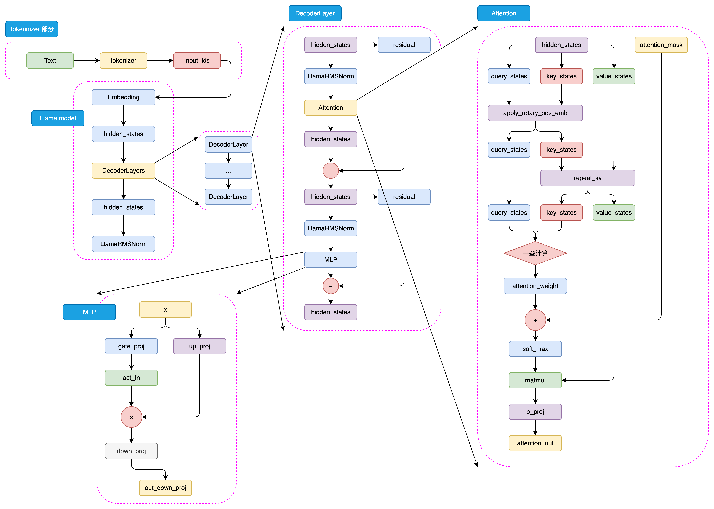

从 Transformer 的实现细节往上看，预训练语言模型的分化主要由三件事决定：**目标函数、信息流方式、工程可扩展性**。

这篇文章主要回答三个问题：BERT 为什么适合理解任务，T5 为什么适合统一的 text-to-text 任务，GPT/LLaMA 为什么在大模型阶段更常见。复习时先抓住一个判断框架：**模型能看见什么信息、被训练去预测什么、能否高效扩展**。

---

## 一、在比较模型之前，先把三个底层件讲清楚

### 1.1 Tokenizer 是文本到 token 的输入协议

无论 BERT、T5 还是 GPT，第一步都是先把文本稳定地映射为离散 token ID。这个过程通常包括：

1. 文本规范化
2. 预切分
3. 子词切分
4. 映射到词表 ID
5. 加入特殊 token

Tokenizer 要在 **词表规模、未登录词覆盖率、序列长度、训练与推理成本** 之间做平衡。  
这也是为什么 BERT 会用 WordPiece，RoBERTa 更偏向 byte-level BPE，而 LLaMA 又会在 tokenizer 设计上继续优化编码效率。

### 1.2 Embedding 的本质，是一个可学习的查表矩阵

Embedding 层本质上是一个可训练的查表矩阵：

$$
E \in \mathbb{R}^{V \times d}
$$

其中 $V$ 是词表大小，$d$ 是隐层维度。输入一个 token ID，本质上就是从矩阵里取出对应的一行向量。  
如果写成 one-hot 形式，它等价于：

$$
e = x^\top E
$$

也正因为如此，词表一旦变大，Embedding 参数会迅速膨胀，这正是 ALBERT 要做 Embedding 分解的直接背景。

### 1.3 预训练目标，往往比“模型名字”更能决定能力边界

同样是 Transformer，不同预训练目标会强烈影响模型最终擅长什么：

- **MLM**：更适合理解和表征学习
- **span corruption**：适合条件生成和统一任务接口
- **CLM**：最贴近真实生成过程，训练目标与推理过程一致

所以比较预训练模型时，不要只记模型名字，要先看它的预训练目标。目标函数会决定模型更偏理解、条件生成，还是开放式续写。

---

## 二、三条路线：分别解决三类问题

| 架构 | 代表模型 | 预训练目标 | 注意力可见性 | 更擅长的任务 |
|------|----------|------------|--------------|--------------|
| **Encoder-Only** | BERT / RoBERTa / ALBERT | MLM（+ NSP / SOP） | 双向 | 分类、匹配、检索、序列标注 |
| **Encoder-Decoder** | T5 | span corruption / 去噪重建 | Encoder 双向，Decoder 因果，并带 Cross-Attention | 翻译、摘要、问答、条件生成 |
| **Decoder-Only** | GPT / LLaMA | CLM | 因果单向 | 开放生成、对话、代码、长文本续写 |

这张表给出一个复习判断：

> **模型结构和“它想看见什么信息、又想预测什么目标”强耦合。**

---

## 三、BERT 路线：为什么它能统治预训练模型时代的 NLU

BERT 把 **预训练 + 微调** 这条路推成了 NLP 的主范式：模型先在大规模语料上学习通用表征，再到具体任务数据上微调。

  
  
图 1. BERT 架构图，图片引自 Happy-LLM 原文

### 3.1 BERT 为什么天然适合理解任务

BERT 本质上是把 Transformer 的 **Encoder** 堆起来。  
这里要记两个特点：

1. **双向自注意力**：每个 token 都能同时看到左边和右边上下文。
2. **输出的是上下文化表示**：它更适合作为文本编码器，而不是直接生成器。

这意味着 BERT 很擅长回答这类问题：

- 这句话表达的是正面还是负面？
- 这两个句子是不是语义相近？
- 这个 token 在句子里应该被标成什么类别？

这些都属于“先理解，再判别”的任务。

### 3.2 MLM + NSP：BERT 当时怎么做预训练

BERT 最有代表性的预训练任务是 **MLM + NSP**。

**MLM（Masked Language Model）** 的核心是“完形填空”：

- 随机选取 15% token 做预测目标
- 其中 80% 替换成 `<MASK>`
- 10% 随机替换
- 10% 保持不变

这个设计很巧。它既让模型学习双向上下文，又尽量缓和了“预训练时看见 `<MASK>`，下游使用时看不见 `<MASK>`”的分布落差。

**NSP（Next Sentence Prediction）** 则让模型学习句间关系。  
虽然这个任务后来被广泛质疑，但在 BERT 当时的设计里，它表达的是另一个训练诉求：模型不只学 token 级语义，也要学句级关系。

### 3.3 BERT 之后，大家主要在优化什么

BERT 之后的改进，主要围绕两个瓶颈展开：训练是否充分，以及参数是否冗余。

**RoBERTa** 的改进方向是“训练得更充分”：

- 去掉 NSP，只保留 MLM
- 用动态 masking 替代静态 masking
- 训练更多 token、更大 batch、更长步数
- 使用更大的 BPE 词表

它传达出的信号非常明确：**很多时候，问题出在训练规模还没打满。**

**ALBERT** 的改进方向则是“把参数做轻”：

- Embedding 分解：把 $V \times H$ 变成 $V \times E + E \times H$
- 跨层参数共享：多层重复计算，但共享同一层参数
- 用 SOP 替换 NSP，强化句序关系建模

ALBERT 的复习要点是：**参数量减少，不等于计算量按比例下降。**
它主要减少存储和参数冗余，不等于计算量也会按同样比例下降。

### 3.4 BERT 路线的边界也很清楚

BERT 直到今天依然非常有用，尤其是在：

- 标注数据比较充分的分类任务
- 高吞吐、低延迟的判别式场景
- 检索、排序、匹配、序列标注

但它的短板同样明显：**它不是为原生生成设计的。**  
如果任务目标是开放式生成，BERT 通常就不再是最自然的选择。

---

## 四、T5 路线：把任务统一成 text-to-text

如果说 BERT 偏表征学习，GPT 偏自回归生成，那么 T5 的做法是：**把所有任务都表述成 text-to-text。**

  
  
图 2. T5 架构图，图片引自 Happy-LLM 原文

### 4.1 为什么 Encoder-Decoder 结构这么自然

T5 保留了完整的 Encoder 和 Decoder：

- **Encoder** 负责把输入“读懂”
- **Decoder** 负责在因果约束下逐步生成输出
- **Cross-Attention** 负责让 Decoder 在每一步都能“按需查询” Encoder 的结果

这套结构非常适合翻译、摘要、生成式问答这类任务，因为它们天然就是：

> 输入一段文本，输出另一段文本

这和 Seq2Seq 任务的形式完全匹配。

### 4.2 T5 真正想统一的是任务接口

T5 的基本想法是：**所有 NLP 任务都写成文本到文本。**

例如：

- 情感分类：`classify: 这是一个很好的产品` -> `positive`
- 摘要：`summarize: ...` -> 摘要文本
- 翻译：`translate English to German: ...` -> 德文结果

这种设计把原本碎片化的任务接口统一成同一种输入输出形式：

- 不需要为每个任务单独设计输出头
- 不需要为不同任务维护完全不同的输入输出形式
- 多任务训练和迁移更容易组织

复习 T5 时要记住：它不只是一个 Encoder-Decoder 模型，也是在标准化任务表达方式。

### 4.3 span corruption 为什么比逐 token mask 更合理

T5 的预训练采用 **span corruption**：

- 随机遮蔽连续文本片段
- 用哨兵 token（如 `<extra_id_0>`）占位
- 让 Decoder 重建被遮蔽的原始 span

这比逐 token mask 更贴近自然语言中的“片段恢复”，也更符合 Encoder-Decoder 的生成机制。

### 4.4 T5 为什么没有成为今天 LLM 的绝对主流

T5 很适合条件生成，但在超大规模时代没有成为最主流基座，主要受工程链路影响：

- 架构比 Decoder-Only 更复杂
- 推理链路更长
- 部署和时延成本通常更高

可以这样记：**T5 的优势是任务表达统一；Decoder-Only 的优势是生成链路更简洁、更容易扩展。**

---

## 五、GPT 路线：为什么大模型时代最终收敛到 Decoder-Only

如果说 BERT 代表预训练模型时代的理解路线，GPT 则代表大模型时代的自回归生成路线。

  
  
图 3. GPT 架构图，图片引自 Happy-LLM 原文

### 5.1 GPT 的设计到底解决了什么问题

GPT 采用 **Decoder-Only + CLM** 的组合，本质上是在做自回归建模：

$$
p(x) = \prod_{t=1}^{T} p(x_t \mid x_{1:t-1})
$$

这意味着模型在第 $t$ 个位置只能看到历史 token，不能看到未来 token，所以必须使用 **causal mask**。

这个设计带来几个直接结果：

- **任务高度匹配**：天然就是为生成服务
- **训练和推理一致**：训练时预测下一个 token，推理时也生成下一个 token
- **结构更简洁**：不需要 Encoder，也不需要 Cross-Attention
- **更容易做大规模扩展**：训练、部署、推理链路都更直接

复习 GPT 时要抓住一句话：**Decoder-Only + CLM 把训练目标、推理方式和工程扩展统一到了“预测下一个 token”上。**

### 5.2 一个很容易混淆的点：CLM 训练并不慢在“逐 token”

很多人第一次接触 GPT 会以为：既然是自回归，那训练是不是也要一个 token 一个 token 地慢慢跑？

- **训练阶段**：常用 teacher forcing，可以一次前向并行计算所有位置的损失
- **推理阶段**：需要逐 token 自回归生成，因为每一步都依赖上一步生成的新 token

所以 causal mask 限制的是“信息可见性”，不等于训练时完全失去并行性。

### 5.3 GPT-1 到 GPT-3 验证了什么

从 GPT-1 到 GPT-3，最重要的是一个路线被连续验证了：

- 模型规模继续增大
- 预训练数据继续增大
- 训练工程继续增强
- zero-shot / few-shot 开始明显展现价值

这条路线验证了一件事：**当 CLM 配上足够大的模型和数据时，模型不只会生成文本，也会在很多理解任务上表现出泛化能力。**

这也是为什么后来 LLM 逐步从“预训练 + 微调”范式，走向了“预训练 + 指令跟随 + 上下文学习”的新范式。

---

## 六、LLaMA：Decoder-Only 路线走向工程成熟的代表

LLaMA 没有推翻 GPT 的基本方向，而是在 Decoder-Only + CLM 路线上做了更工程化、更容易复用的实现。

  
  
图 4. LLaMA 架构图，图片引自 Happy-LLM 原文

### 6.1 LLaMA 继承了什么

LLaMA 继续采用 Decoder-Only 主干，因此保留了 GPT 路线的几个优点：

- 单栈解码器，结构清晰
- 因果建模，目标直接
- 易于扩展到更大参数量与更长上下文

### 6.2 LLaMA 又优化了什么

按这部分学习材料，LLaMA 系列的代表性优化包括：

- 使用 **RoPE** 注入位置信息，增强相对位置建模能力
- 在更大版本上引入 **GQA** 等注意力优化
- 使用更高质量、更大规模的预训练语料
- 持续优化 tokenizer 与训练配方

这些改动单看都不是“换范式”，但合在一起，会让同样的 Decoder-Only 路线更稳，也更适合真实应用。

### 6.3 为什么今天很多 LLM 都接近 LLaMA 路线

进入大模型阶段，基座模型需要同时满足这些条件：

- 能不能稳定训练到很大
- 能不能高效推理
- 能不能方便做指令微调和对齐
- 能不能作为通用基座支撑聊天、代码、Agent、工具调用

在这几个指标上，Decoder-Only 路线很占便宜。  
所以从历史上看，**LLaMA 的流行，更像是 GPT 路线进一步工程化后的结果。**

---

## 七、GLM：一条很有启发性的“融合路线”

GLM 这条路线特别有意思，因为它尝试把 **MLM 的双向理解能力** 和 **CLM 的自回归生成能力** 合在一起。

它的几个设计点包括：

- blank infilling 式预训练
- 特殊 attention mask
- 二维位置编码
- 在被遮蔽片段内部按自回归顺序生成

这条路线想做的事很直接：**既要理解，也要生成。**

从今天回头看，GLM 没有成为超大规模基座的主流，但它并不“失败”。  
更准确地说，GLM 留下了一个路线判断：

> 在预训练模型时代，融合式目标很有吸引力；但到超大规模 LLM 阶段，工程可扩展性和训练稳定性会把很多选择重新拉回 CLM 主线。

这也是为什么后续 ChatGLM 系列在大方向上逐渐回归更经典的 CLM 路线。

---

## 八、这部分内容的三个复习结论

### 8.1 架构和目标函数是强绑定的

- BERT 的强项来自双向表征学习
- T5 的强项来自 Encoder-Decoder 的条件生成
- GPT/LLaMA 的强项来自 CLM 的一致性和扩展性

### 8.2 预训练模型时代和大模型时代，最优解不一定相同

在 PLM 时代，BERT 这样的 Encoder-Only 模型完全可以统治 NLU。  
但到了 LLM 时代，随着模型和数据规模继续放大，Decoder-Only 开始在综合能力上占据主导。

### 8.3 实现细节背后都有取舍

Tokenizer、Embedding、mask、位置编码、参数共享，这些看似实现细节的设计，都对应具体的建模取舍。复习时要能回答：

- 它为什么要这样看信息？
- 它为什么要这样定义训练目标？
- 它为什么在那个时代有效，又为什么在另一个时代失势？

---

## 九、写在最后：模型路线的认知框架

如果前面对 Transformer 的学习主要回答“模型是怎么工作的”，那么这一篇要回答的是：**为什么不同阶段会偏向不同架构。**

BERT 的优势来自双向理解，T5 的优势来自 text-to-text 统一接口，GPT/LLaMA 的优势来自简单一致的生成目标和更直接的规模化路径。GLM 则提醒我：融合式目标很有启发，但路线能不能走远，还要看工程上能不能稳定放大。

继续往下看时，可以重点追问一个问题：
**为什么一旦进入 LLM 时代，Decoder-Only + CLM 会从“其中一条路线”变成“几乎默认路线”？**  
有了目标函数、信息流和扩展性这三个维度，这个问题就可以具体分析，而不只是凭感觉判断。

---

## 参考资料

- [Datawhale. Happy-LLM：第三章《预训练语言模型》](https://github.com/datawhalechina/happy-llm/blob/main/docs/chapter3/%E7%AC%AC%E4%B8%89%E7%AB%A0%20%E9%A2%84%E8%AE%AD%E7%BB%83%E8%AF%AD%E8%A8%80%E6%A8%A1%E5%9E%8B.md)
- [Jacob Devlin et al. BERT: Pre-training of Deep Bidirectional Transformers for Language Understanding](https://arxiv.org/abs/1810.04805)
- [Yinhan Liu et al. RoBERTa: A Robustly Optimized BERT Pretraining Approach](https://arxiv.org/abs/1907.11692)
- [Zhenzhong Lan et al. ALBERT: A Lite BERT for Self-supervised Learning of Language Representations](https://arxiv.org/abs/1909.11942)
- [Colin Raffel et al. Exploring the Limits of Transfer Learning with a Unified Text-to-Text Transformer](https://arxiv.org/abs/1910.10683)
- [Alec Radford et al. Improving Language Understanding by Generative Pre-Training](https://cdn.openai.com/research-covers/language-unsupervised/language_understanding_paper.pdf)
- [Tom B. Brown et al. Language Models are Few-Shot Learners](https://arxiv.org/abs/2005.14165)
- [Zhengxiao Du et al. GLM: General Language Model Pretraining with Autoregressive Blank Infilling](https://arxiv.org/abs/2103.10360)
