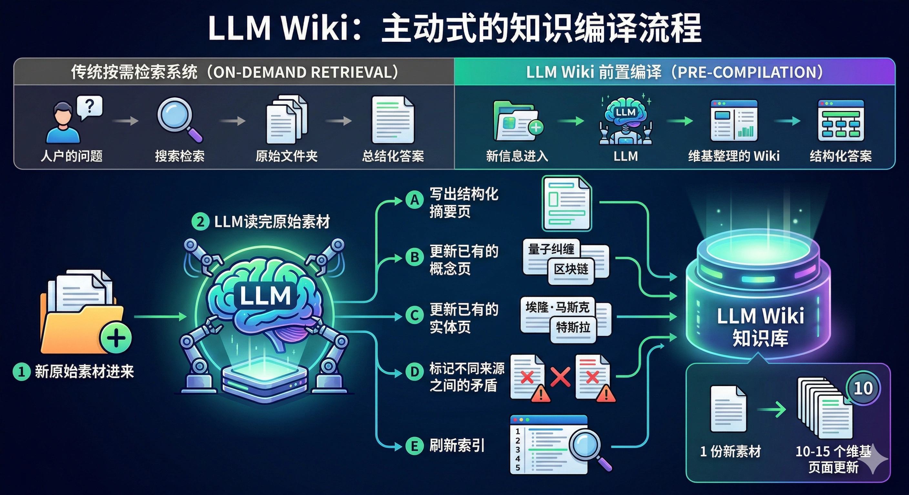

## 引子：从一次性问答到可维护知识库

2026 年 4 月的一天，Andrej Karpathy 在 GitHub Gist 上发布了一篇名为 [LLM Wiki](https://gist.github.com/karpathy/442a6bf555914893e9891c11519de94f) 的文档。它讨论的不是一次性使用 ChatGPT，而是如何**让 LLM 持续维护个人知识库**。

这篇笔记记录两件事：Karpathy 的 LLM Wiki 模式是什么，以及我怎么把它落到自己的 LLM 学习系统里。复习时主要看三层结构和三种操作。

---

## 一、LLM Wiki：从 RAG 到持久知识编译

### 1.1 它想解决什么

常见的 LLM 文档问答模式是 **RAG（Retrieval-Augmented Generation）**：上传文档 -> 检索相关片段 -> 生成回答。它能解决单次问答，但有个问题：**知识不会自动沉淀**。昨天问答中的归纳、矛盾和交叉引用，不会自然变成今天可复用的知识结构。

Karpathy 提出的替代方案是让 LLM **增量构建并维护一个持久 Wiki**：

> 当你加入新资料时，LLM 会阅读它、提取关键信息、整合进现有 Wiki，并更新实体页面、修订主题总结、标记新数据与旧论断的矛盾、强化或质疑正在演进的综合分析。

区别在于：**Wiki 是一个持续维护的知识层**。它不只是临时检索结果，而是把摘要、概念页、实体页、矛盾标记和综合分析长期保存下来。

### 1.2 三层架构



```
┌──────────────────────────────────────┐
│  Schema（AGENTS.md / CLAUDE.md）     │ ← 你和 LLM 共同维护的行为规范
├──────────────────────────────────────┤
│  Wiki（markdown 文件目录）            │ ← LLM 写、你读的知识层
├──────────────────────────────────────┤
│  Raw Sources（原始文档）             │ ← 不可变的来源真值
└──────────────────────────────────────┘
```

- **Raw Sources**：原始材料层，保存论文、文章、代码笔记等来源。只读，不让 LLM 修改。
- **Wiki**：知识加工层，保存摘要页、实体页、概念页、比较分析等 Markdown 页面。LLM 主要维护这一层。
- **Schema**：维护规则层，用来规定 LLM 如何 ingest、query、lint，以及页面格式、引用规范和日志规则。

### 1.3 三种操作

| 操作 | 描述 | 产出 |
|------|------|------|
| **Ingest** | 投入新资料，LLM 阅读、摘要、更新现有页面 | 一次 ingest 可能触及 10–15 个 Wiki 页面 |
| **Query** | 向 Wiki 提问，LLM 综合相关页面生成带引用的回答 | 好的回答可以回写为 Wiki 新页面 |
| **Lint** | LLM 对 Wiki 做健康检查——矛盾、孤立页、缺失引用 | 维护 Wiki 的长期质量 |

### 1.4 为什么这行得通

> *维护知识库的难点不在于阅读或思考——在于记账。更新交叉引用、保持摘要最新、标记新旧数据冲突、维护一致性。人类放弃 Wiki 是因为维护成本增长得比价值更快。LLM 不会厌倦，不会忘记更新引用，能一次性修改 15 个文件。*

复习锚点：Raw Sources 保真，Wiki 负责综合，Schema 约束维护行为。这个模式的价值不在“自动写笔记”，而在降低长期维护成本。

这个模式让我想到 Vannevar Bush 1945 年的 **Memex** 构想：一个带有文档间关联路径的个人知识存储。过去的难点是“谁来维护链接和摘要”；LLM 让这部分维护成本降了下来。

---

## 二、实践：我的 LLM Wiki 搭建

我在自己的知识库中按这个模式搭了一个最小结构：

### 2.1 目录结构

```
Wiki/
├── AGENTS.md              # Schema：工作流规范
├── index.md               # 内容索引：按类别编目所有页面
├── log.md                 # 时间线：append-only 的操作日志
├── raw/                   # Raw Sources 层
│   ├── index.md           # 来源注册表
│   └── inbox/             # 新材料暂存区
│       └── llm-zero-to-one/  # LLM 学习专题
└── pages/                 # Wiki 层
    ├── sources/           # 每份来源的摘要页
    ├── concepts/          # 跨来源的概念归纳页
    ├── entities/          # 实体页（人物/工具/模型）
    ├── queries/           # 问答沉淀页
    └── synthesis/         # 综合分析页
```

### 2.2 流程实录

以收录 Happy-LLM 第一章为例，一次 ingest 大概是这样：

1. 将文章 Markdown 放入 `raw/inbox/llm-zero-to-one/`
2. 在 `raw/index.md` 登记为 `Status = selected`
3. LLM 阅读全文，生成 `pages/sources/happy-llm-chapter1-nlp-basics.md`
4. LLM 判断该来源属于 "LLM 从零学习" 概念域，更新 `pages/concepts/llm-zero-to-one-learning-path.md`
5. 更新 `index.md` 的概念表条目
6. 在 `log.md` 追加操作记录

一份来源会触及多个页面。随着来源增多，概念页会不断补充证据、链接和对比关系，这就是 Wiki 模式区别于普通摘抄的地方。

### 2.3 我学到的一点

实践之后，我最想留下的是这句话：

> **先搭可持续维护的知识系统，再扩充学科内容，可以少掉很多碎片化学习的损耗。**

这和传统“先学东西再整理笔记”的路径不同。学习系统先就位后，每一份新材料都会进入已有页面、索引和日志，而不是散落成临时笔记。

---

## 三、这个模式具体解决什么

这个知识管理模式带来几个直接好处：

1. **学习有据可查**：每次 ingest 和 query 都留有 log 记录，可以回溯学习轨迹。
2. **碎片能慢慢成系统**：零散笔记会进入概念页和综合页，不再只是一堆临时摘抄。
3. **交叉引用不用全靠手动维护**：不同知识点可以自动链接起来。
4. **学习路径更可见**：通过 Obsidian 的图谱视图，可以看到哪些知识节点已经建立，哪些还是空白。

---

## 四、下一步

按照 Happy-LLM 的课程路线，接下来的学习计划包括：

- [ ] **预训练语言模型**：比较 Encoder-only (BERT)、Encoder-Decoder (T5)、Decoder-only (GPT) 三种范式
- [ ] **大语言模型专题**：LLM 的定义、涌现能力、训练策略
- [ ] **动手搭建**：基于 PyTorch 实现 LLaMA2，从 Tokenizer 到预训练的完整链路
- [ ] **训练实践**：预训练 → SFT → LoRA/QLoRA 高效微调
- [ ] **应用层**：RAG 检索增强、Agent 智能体

每个阶段的学习材料都会通过 Wiki 的 ingest 流程进入知识网络。这篇博文本身，也算是一次从 Wiki 到 Blog 的输出。

---

## 参考资料

- [Karpathy, A. *LLM Wiki*. GitHub Gist, 2026.](https://gist.github.com/karpathy/442a6bf555914893e9891c11519de94f)
- [Datawhale. *Happy-LLM：从零开始构建大模型*. GitHub, 2025.](https://github.com/datawhalechina/happy-llm)
- Bush, V. *As We May Think*. The Atlantic, 1945.
